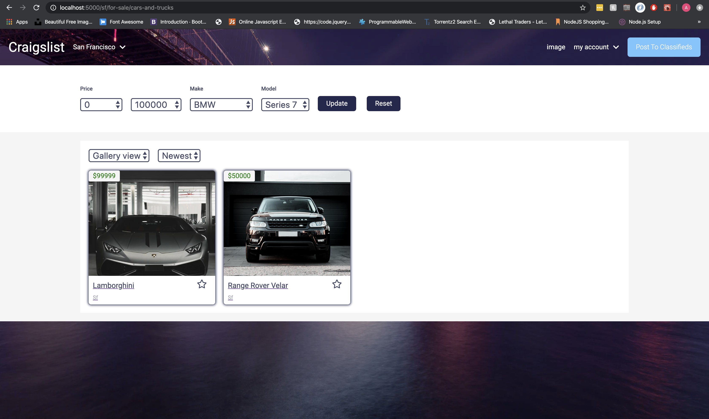

# Craiglist Clone.

_Its a craiglist clone with react front-end and node.js backend , it uses react-router to handel all the html request's._

_Following are the used technologies_

* node.js
* react.js
* webpack
* gulp
* axios

_to alter the data in application add the data in json format in data folder._
